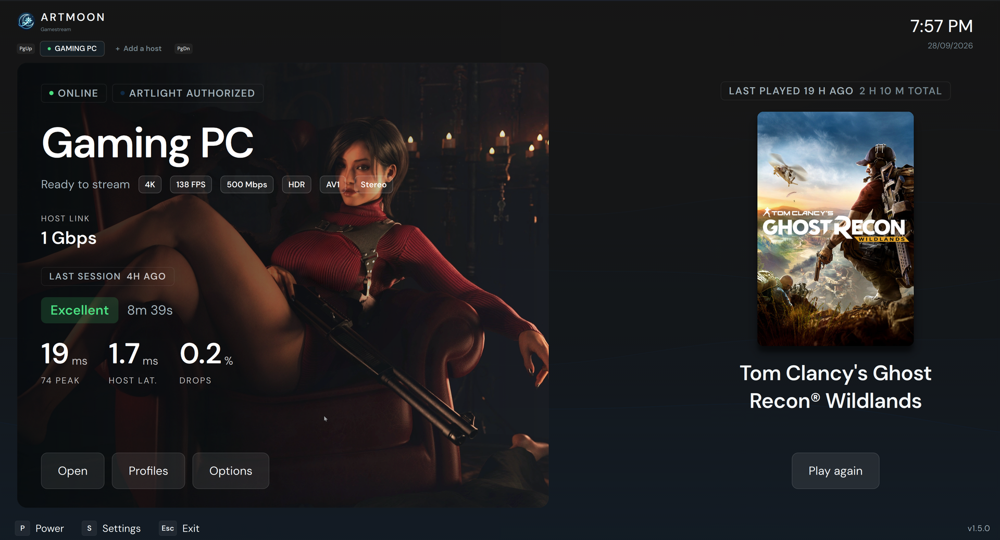
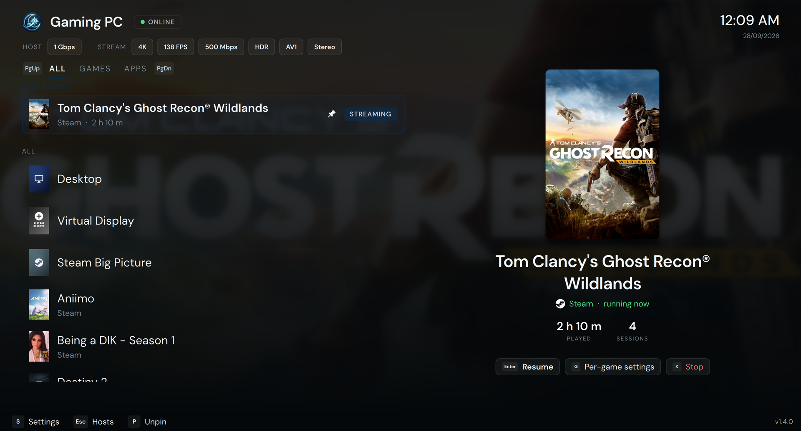
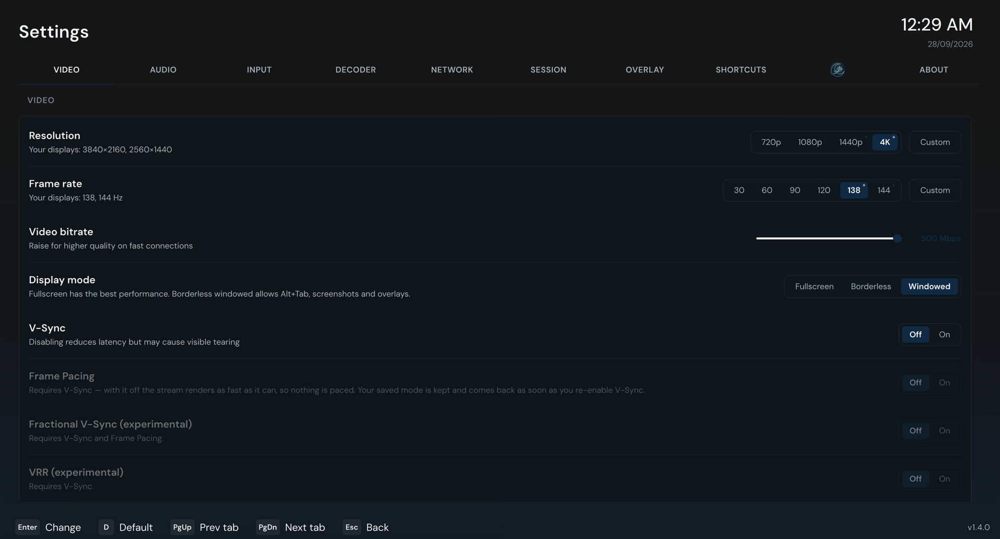

<div align="center">


# ArtMoon

**Your games, on every screen in the house.**

A gamepad-first streaming client built to work best with [ArtLight](https://github.com/onaiaku/ArtLight)

<a href="https://github.com/onaiaku/ArtMoon"></a>
<a href="https://github.com/onaiaku/ArtMoon"></a>
<a href="https://www.gnu.org/licenses/gpl-3.0"></a>

</div>

---

<div align="center">
  
</div>

<div align="center">

<strong>ArtMoon</strong> pairs with its host-side companion, <a href="https://github.com/onaiaku/ArtLight"><strong>ArtLight</strong></a>, for a full sofa-to-host experience.

</div>

<div align="center">
  
</div>

## ✅ Compatibility

**Windows 10 and 11**, **Linux** (AppImage, x86_64 and arm64), and **Android** (APK, Android 5.0+). Works as an ordinary Moonlight-compatible client against any **[ArtLight](https://github.com/onaiaku/ArtLight)**, Sunshine, Apollo, or Vibepollo host, and unlocks its paired feature set when the host companion is running.

## 🌙 Pair it with ArtLight

[**ArtLight**](https://github.com/onaiaku/ArtLight) is our host — a self-hosted game streaming stack for Windows/Linux, one installer with everything in it:

- **ArtLight Server** — streaming host, with a pre-signed virtual display driver and a clean web UI
- **ArtLight Control** — companion app with a live dashboard: RTT, bitrate, frame drops, host stats ticking every second, plus per-session quality reports **(Windows only)**
- **USB device sharing** — switch on a keyboard, a mouse or a USB drive in ArtMoon and it is handed to the host, where it behaves as though it were plugged in. The receiving half is ArtLight Server, so this is the feature that needs ArtLight rather than merely preferring it. Local network or VPN for now, with authentication still to come

ArtMoon works with any Moonlight-compatible host, but **it works best with ArtLight** — that's where the paired features come alive.

## 🔥 Features

**🆕 Library — games, apps, everything**
- **Games, Apps and All** — the host page splits its library into the games you play and everything that isn't one (your desktop, Steam Big Picture, the host's own apps), with an **All** tab that puts every launchable thing in one list
- **Move anything between them** — a desktop you open every night belongs on whichever tab you say, remembered per host
- **Pin what you actually play** — pinned games gather at the top of the library, under *Last played*
- **Resume, straight from Home** — a host that's already streaming shows what's running, and *Play* becomes **Resume**

**📺 Native refresh-rate detection**
- The FPS selector reads what your display *actually supports* instead of a hardcoded 30/60/90/120 list — a 138 Hz monitor offers 138, a 144 Hz monitor offers 144
- The global selector asks the display the window is on; per-game and per-host overrides consider every connected display
- The classic presets stay in the list, merged with your display's real rates, sorted

<div align="center">
  
</div>

**🕹️ Gamepad-first, keyboard-equal**
- Every action is reachable from the pad: D-pad across host tabs, library, settings tabs and dialogs, with a clickable prompt bar along the bottom
- **Prompts follow the device in your hands** — touch the keyboard and each glyph becomes the key to press; pick the pad back up and they return to that controller's own icons (Xbox / PlayStation / Nintendo, auto-detected or forced)
- **Prompts can be pinned to the pad** — Auto, Controller or Keyboard & mouse, for the pads that send clicks and keys from the same device, like Steam Input or a Steam Deck
- **Rebindable shortcuts** — every in-stream keyboard hotkey and all three controller combos, in *Settings → Shortcuts*

**🏠 Home and the host page**
- **Home** is your hosts as tabs under the wordmark, the selected one filling the screen: name, state, addresses, stream settings and actions at once
- **The host page** puts the library down the left at full height and the game in the spotlight beside it — cover, name, store, and the right verb (*Resume* or *Play*)
- **Per-host backgrounds** — a colour you pick or a picture of your own, with the card's gradient derived from it, and the card's opacity set to taste
- **Your accent colour** — five presets or any hex code. Status colours never follow it: online stays green, *Shutdown* red

**🆕 Power — both machines**
- **A row per machine** — the host and this device each offer only what they can actually do: keep on, sleep, restart, shut down
- **Windows Update** sits on the row that restarts or shuts down, and only appears when there's something waiting
- **Sleep stays asleep** — a host you've put to sleep waits to be woken instead of being roused by this device coming back on
- Asks before it sleeps a host it can't wake again — away from home, or a host without wake-on-LAN

**🎬 In-stream**
- **Performance overlay, built line by line** — eleven lines to choose from, switched on and off on the overlay itself
- **Stream Settings panel** — change resolution, frame rate, bitrate, HDR and frame pacing **while streaming**
- **Custom resolutions** — any width and height, not just the presets
- **Match refresh rate** — runs your display at the stream's frame rate for the session (Fullscreen), per-host overridable
- **🆕 Shared clipboard** — copy here, paste there, both ways, up to 32 KB at a time. Off until you switch it on, and the host can refuse. Passwords stay out of the other side's history
- **Less work for the GPU at 4K** — frames reach the screen from wherever they were decoded, instead of being copied across the machine first

**🆕 USB device sharing — your own hardware, inside the stream**
- **The real device, not a pretend one** — *Settings → Input* lists the USB hardware plugged into this machine, each with a name, a vendor and an Off/On switch. Switch one on and it is handed to the machine you are streaming from, so the game is talking to the *physical* device: nothing is injected, which is what gets input into a game that ignores ordinary streamed input
- **Not only keyboards and mice** — a USB drive works the same way. Plug it in here, switch it on, start a stream, and it appears on the far machine with its files browsable and copyable in both directions, as though it were plugged in there
- **Yours until the stream ends** — nothing is shared until you switch something on. A device is lent for the session and handed back when it finishes, and the list on its own changes nothing about your devices
- **Needs [ArtLight](https://github.com/onaiaku/ArtLight) at the far end** — the host you stream from is the half that receives the device. Other hosts are not supported for this yet
- **Local network or VPN only, and no authentication yet** — this release does not reach across the open internet, and there is **no password, no pairing step and no account** on it: a device you switch on is offered to whatever can reach the port. Keep both machines on the same network or on a tunnel, and do not expose it. Authentication comes before anything wider

**⬆️ Built-in updater**
- ArtMoon checks GitHub releases and tells you when a new version is out — one press of **Update Now** and it updates itself: download, quit, install, relaunch. No manual downloads, no terminal on Windows
- **Linux** reuses the one-line install script under the hood, so updating is the same command as installing
- The version card shows what's installed, what's latest, and clickable changelogs for every release

**⚙️ Settings and profiles**
- Ten tabs, pill-style selectors, inline subtitles instead of tooltips
- **Per-host profiles** — up to three named profiles per host, each overriding resolution, frame rate, bitrate, HDR, codec, display mode, V-Sync, frame pacing, audio and more
- **Per-game overrides** on top of the active profile
- **Profiles and overrides on tabs** — one section at a time with LB/RB to move between them, and the number of values you've changed shown on each
- **Inherited values say where they come from** — *Global: 4K*, *Docked 4K: 120* — and one button clears a row, or the whole set
- Every FPS list is built from what your display actually reports — no hardcoded presets where your hardware can speak for itself

**🤖 Phone, tablet and TV**
- The same client on Android, with a picker built for a remote and a UI that scales from a phone in your hand to a TV across the room
- Last session sits on the Home hero card — what you played, how it went, and a way straight back in

## 🔗 Paired Features (with ArtLight Control)

These cross the bridge and need both apps. All switched on **per host**, in **Settings → ArtLight** (the companion tab). Streaming itself is never affected either way.

- **Host link matching** — the client measures its wired link and asks the host to match it, fixing audio dropouts from speed-mismatched links
- **Seamless launch** — the stream window stays hidden until the game is really on screen
- **Remote PIN unlock** — wake the host and sign in with its Windows PIN from the sofa
- **Host session report** — grade, duration, RTT, frame latency, drop rate, covers of what was played
- **Host metrics in the overlay** — GPU, encoder, temps, VRAM, CPU, network
- **Store badges** — Steam, Epic, GOG, Ubisoft, Xbox, Battle.net, EA App
- **Session quality reporting** — grades and charts from per-second telemetry
- **Remote host power-off / Windows Update** — from the sofa
- **Tailscale in one tile** — one host, both addresses, automatic selection

## 📦 Installation

**Windows** — download the installer from the [**Releases page**](https://github.com/onaiaku/ArtMoon/releases/latest) and run it.

**Linux** — one line:

```bash
curl -fsSL https://raw.githubusercontent.com/onaiaku/ArtMoon/main/install.sh | bash
```

The script installs the AppImage to `/usr/local/bin`, adds a desktop entry, and doubles as the updater — run it again to update.

**Android** — (Phone/Tablet/TV) — download `ArtMoon-<version>-android.apk` from the [**Releases page**](https://github.com/onaiaku/ArtMoon/releases/latest) and sideload it (Android will ask you to allow installs from that source — one toggle, then it installs like any app).

## 🏗️ Architecture

A Qt 6 / QML fork of [Moonlight-Qt](https://github.com/moonlight-stream/moonlight-qt). The UI layer and the paired-feature bridge are ours.

```
ArtMoon (Qt, client PC)
    │  TCP port 47998
    ▼
ArtLight Control (host PC)  →  Named Pipe  →  ArtLightControlService (LocalSystem)
                                                           │
                                                           ▼
                                                NIC speed via CIM/WMI
                                                Host assets via filesystem
                                                Windows Update via WUA
```

## 🤝 Acknowledgements

- [**Moonlight**](https://github.com/moonlight-stream/moonlight-qt) — the open-source client this fork is built on; full credit to its contributors
- [**ArtLight**](https://github.com/onaiaku/ArtLight) — the host-side companion; the paired features above are its half of the bridge
- [**Vibeshine**](https://github.com/Nonary/vibeshine) and [**Vibepollo**](https://github.com/Nonary/Vibepollo) — fully supported hosts
- [**usbipd-win**](https://github.com/dorssel/usbipd-win) — the USB/IP engine behind device sharing. Its installer is carried inside ArtMoon's Windows setup, so sharing devices works on a PC that has never had USB/IP, and its licence is the GPL-3.0 that ArtMoon is itself released under

> ⚠️ **Not affiliated with or endorsed by the Moonlight project.** For upstream Moonlight support, use the [official moonlight client repo](https://github.com/moonlight-stream/moonlight-qt).

## License
[](https://www.gnu.org/licenses/gpl-3.0)

ArtMoon is released under the GPL v3 License, in accordance with the upstream Moonlight license.
